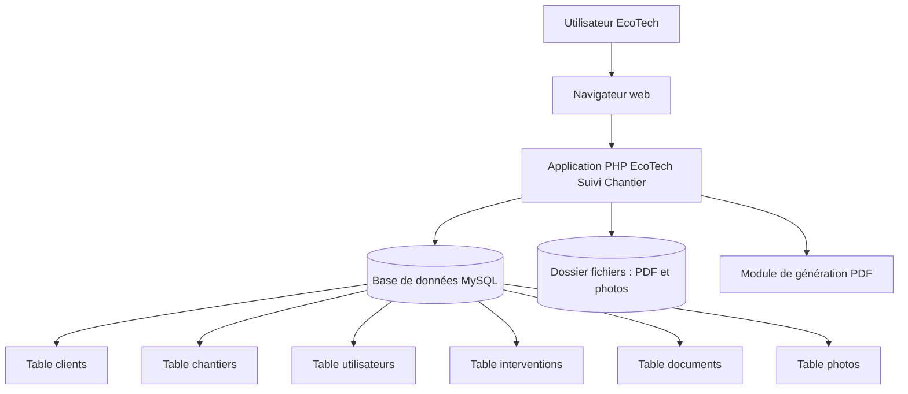

# Architecture prévue — EcoTech Suivi Chantier

## Objectif

Ce document présente l’architecture simple prévue pour l’application EcoTech Suivi Chantier.

L’objectif est de montrer comment les utilisateurs, l’application, la base de données et les fichiers vont interagir.

## Architecture générale

L’application sera une application web accessible depuis un navigateur.

Elle sera développée avec une stack simple :

- PHP ;
- MySQL ;
- Bootstrap ;
- HTML / CSS ;
- serveur local pour la démonstration.

## Schéma simplifié

## Composants prévus

| Composant | Rôle |
|---|---|
| Navigateur web | Permet aux utilisateurs d’accéder à l’application |
| Application PHP | Gère les pages, les formulaires et les traitements |
| Base MySQL | Stocke les utilisateurs, clients, chantiers et interventions |
| Dossier fichiers | Stocke les documents PDF et les photos |
| Génération PDF | Permet de produire un rapport de chantier |

## Données principales

Les données principales prévues sont :

- utilisateurs ;
- rôles ;
- clients ;
- chantiers ;
- documents ;
- photos ;
- interventions.

## Justification

Cette architecture est simple et adaptée au BTS SIO SLAM.

Elle permet de démontrer :

- une application web fonctionnelle ;
- une base de données relationnelle ;
- la gestion de fichiers ;
- des droits utilisateurs ;
- une production PDF.

## Limites

La première version ne prévoit pas :

- d’application mobile ;
- d’accès client ;
- de paiement en ligne ;
- de notifications automatiques ;
- de synchronisation avancée avec Google Drive.

Ces limites permettent de garder un projet réaliste et terminable.