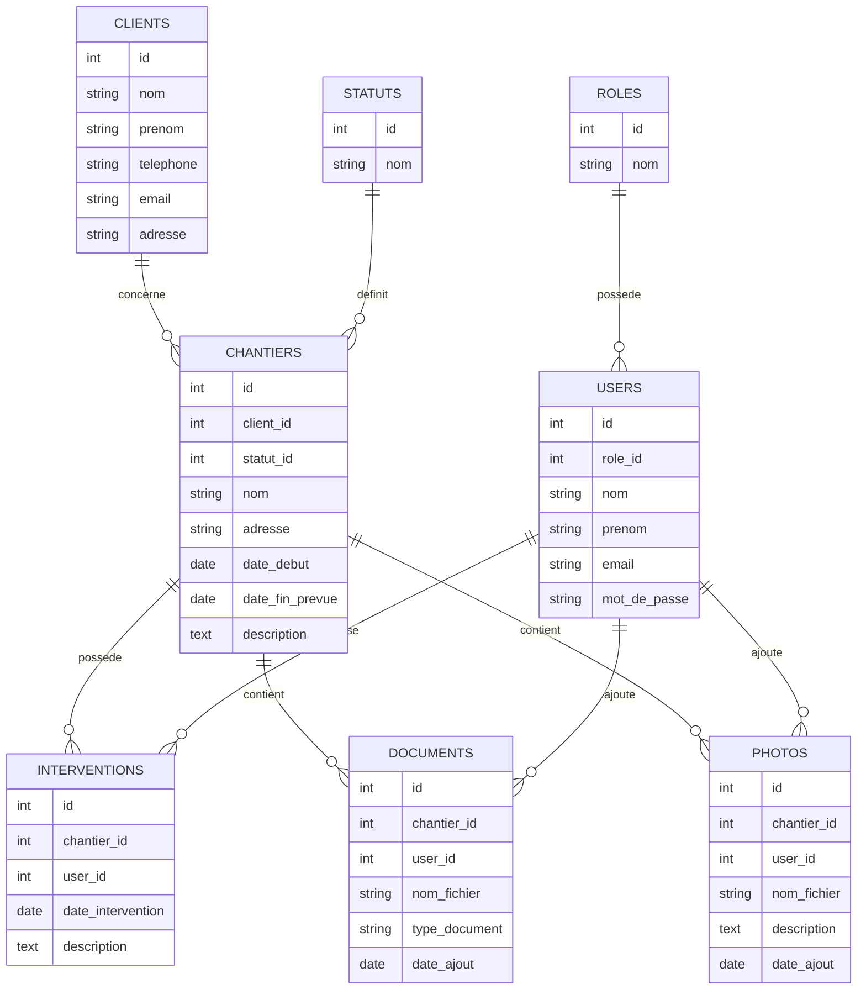

# MCD brouillon — EcoTech Suivi Chantier

## Objectif

Ce document présente un premier modèle conceptuel de données pour l’application EcoTech Suivi Chantier.

Il s’agit d’un brouillon destiné à préparer la future base de données MySQL.

## Entités principales

Les entités principales identifiées sont :

- rôle ;
- utilisateur ;
- client ;
- statut ;
- chantier ;
- document ;
- photo ;
- intervention.

## Diagramme brouillon

## Explication simple

Un client peut avoir plusieurs chantiers.

Un chantier possède un statut, par exemple :

- prévu ;
- en cours ;
- en attente ;
- terminé ;
- annulé.

Un chantier peut contenir plusieurs documents, plusieurs photos et plusieurs interventions.

Un utilisateur peut ajouter des documents, des photos ou enregistrer une intervention.

Chaque utilisateur possède un rôle :

- administrateur ;
- gérant ;
- employé.

## Limite du modèle

Ce modèle reste volontairement simple.

Il pourra être amélioré plus tard si nécessaire, mais il est suffisant pour préparer une première version BTS SIO SLAM.