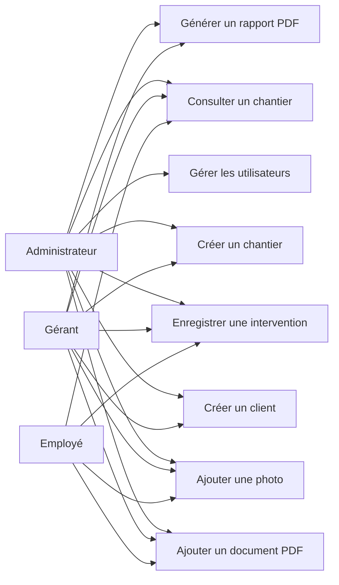

# Diagramme des cas d’utilisation — EcoTech Suivi Chantier

## Objectif

Ce document présente un schéma simplifié des cas d’utilisation principaux de l’application EcoTech Suivi Chantier.

Le schéma est volontairement simple afin de rester adapté au niveau BTS SIO SLAM.

## Diagramme simplifié

## Lecture du diagramme

L’administrateur possède tous les droits.  
Le gérant peut gérer les clients, les chantiers, les documents, les photos, les interventions et les rapports.  
L’employé dispose de droits plus limités : il peut consulter les chantiers, ajouter des photos, ajouter des interventions et déposer certains documents.

## Justification des rôles

Le projet doit rester simple et réaliste. C’est pour cela que seuls trois rôles sont prévus :

- administrateur ;
- gérant ;
- employé.

Aucun accès client n’est prévu dans la première version.

## Lien avec E6 SLAM

Ce diagramme prépare la conception de la solution applicative. Il permet d’identifier les fonctionnalités principales avant de créer les maquettes, la base de données et les pages PHP.